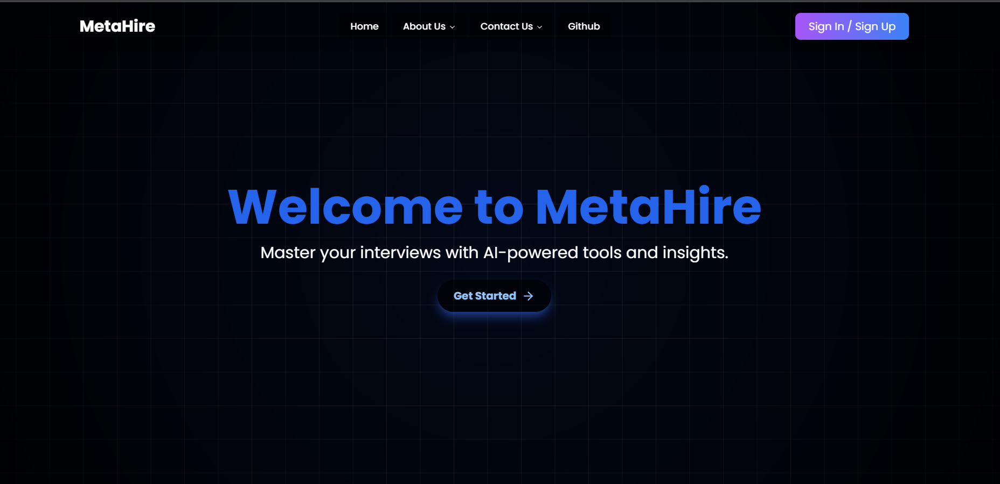
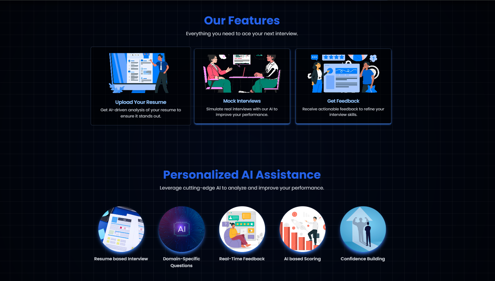
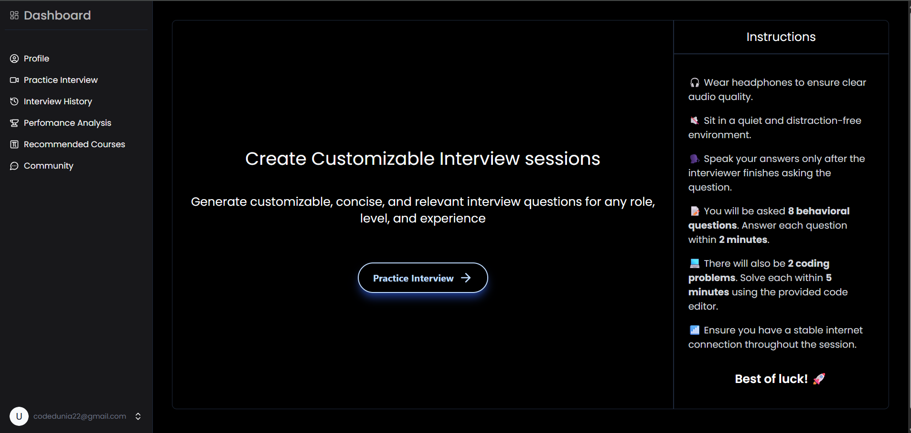

# 💼 MetaHire

MetaHire is an AI-powered full-stack web application designed to **streamline the hiring process** for companies and job seekers. Built on the **MERN stack**, it integrates **machine learning** to intelligently screen resumes, match candidates with jobs, and optimize recruitment workflows.  

---

## 📝 Table of Contents  

- [✨ Features](#-features)  
- [🛠 Tech Stack](#-tech-stack)  
- [🖼 Screenshots](#-screenshots)  
- [⚙️ Installation](#️-installation)  
- [🚀 Usage](#-usage)  
- [🛡 Admin Functionalities](#-admin-functionalities)  
- [🔮 Future Improvements](#-future-improvements)  
- [👨‍💻 Contributors](#-contributors)  
- [📬 Contact](#-contact)  

---

## ✨ Features  

- 👤 **User Authentication** (Admin, Recruiter, Job Seeker)  
- 📄 **Smart Resume Upload & Parsing** with ML-based keyword extraction  
- 🤖 **AI-driven Job Recommendations** for seekers  
- 📝 **Job Posting & Management System** for recruiters  
- 📊 **Real-time Dashboard** for recruiters & job seekers  
- 🔔 **Application Tracking** with status updates  
- 📅 **Interview Scheduling** & feedback management  
- 📈 **Machine Learning Insights** to rank candidates based on job-fit score  
- 📱 **Responsive UI** for seamless multi-device experience  

---

## 🛠 Tech Stack  

| Layer        | Technology                                                                 |
|--------------|-----------------------------------------------------------------------------|
| Frontend     | React.js, HTML, CSS (Tailwind), JavaScript                                 |
| Backend      | Node.js, Express.js                                                         |
| Database     | MongoDB with Mongoose                                                       |
| Authentication | JWT-based authentication                                                   |
| Machine Learning | Python (scikit-learn / TensorFlow), integrated via APIs                  |
| Other Tools  | Git, GitHub, VS Code, Postman                                               |

---

## 🖼 Screenshots  

| Home | Features & Functionality | Dashboard |
|------|---------------------------|-----------|
|  |  |  |


---

## ⚙️ Installation  

```bash
# Step 1: Clone the repository
git clone https://github.com/Vishal-Patel2/MetaHire.git
cd MetaHire

# Step 2: Install dependencies
npm install

# Step 3: Configure environment variables (.env file)
DB_HOST=your_database_host
DB_USER=your_database_user
DB_PASS=your_database_password
JWT_SECRET=your_secret_key

# Step 4: Start the backend server
npm run server

# Step 5: Start the frontend application
npm start
```
## 🚀 Usage  

- 🧑‍💼 Recruiters can post jobs, review applications, and track candidates.  
- 👨‍💻 Job Seekers can browse jobs, upload resumes, and apply directly.  
- 📊 ML Models recommend candidates & rank resumes.  
- 🔔 Real-time updates keep users informed about application status.  

---

## 🛡 Admin Functionalities  

- Manage users (recruiters, job seekers, admins).  
- Monitor all job postings and applications.  
- Access **analytics dashboard** with hiring trends.  
- Control ML-based recommendation thresholds.  

---

## 🔮 Future Improvements  

- 🤝 Video Interview Integration with AI-based sentiment analysis.  
- 🔍 Advanced Search with NLP for resume/job descriptions.  
- 📱 Native Mobile App for job seekers & recruiters.  
- 🌍 Multi-language support for global recruitment.  
- 📊 Deeper AI analytics for workforce planning.  

---

## 👨‍💻 Contributors  

- [Vishal Patel](https://github.com/Vishal-Patel2)  

---

## 📬 Contact  

If you have any questions or suggestions, feel free to reach out:  

- 📧 Email: [vishalpatell0.2219@gmail.com](mailto:vishalpatell0.2219@gmail.com)  
- 💼 LinkedIn: [Vishal Patel](https://www.linkedin.com/in/vishal-patel22/)  

---

## 😄 Just for Laughs  

💡 Why do programmers prefer dark mode?  
Because light attracts bugs! 🐛💻  

Happy coding, and may your code be bug-free! 🚀  
